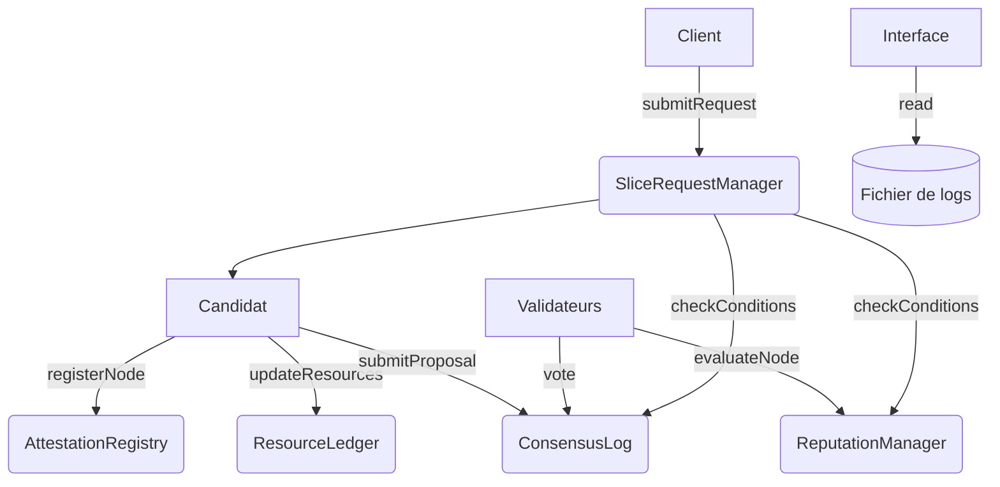
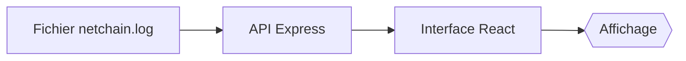

# 🌐 Orchestration de ressources reseaux basée sur la technologie blockchains

**Solution complète pour l'allocation automatisée de ressources réseau via des smart contracts Ethereum avec interface de monitoring**

## 📋 Table des Matières
- [Fonctionnalités](#-fonctionnalités)
- [Architecture Technique](#-architecture-technique)
- [Prérequis](#-prérequis)
- [Installation](#-installation)
- [Configuration](#-configuration)
- [Workflow](#-workflow)
- [Interface Graphique](#-interface-graphique)
- [Déploiement](#-déploiement)
- [Exécution](#-exécution)
- [Sécurité](#-sécurité)
- [Contributeurs](#-contributeurs)

## ✨ Fonctionnalités
- ✅ Orchestration multi-nœuds autonome
- ✅ Consensus décentralisé avec réputation
- ✅ 5 smart contracts interactifs
- ✅ Journalisation complète des transactions
- ✅ Interface de monitoring temps réel
- ✅ Visualisation claire des décisions

## 🏗 Architecture Technique


## 🖥 Interface Graphique
**Visualisation des données** :


**Exemple d'affichage** :
```
✅ APPROUVÉ (4/5 rep, 3/3 votes) 02:13:04
✉️ node3 a voté POUR 02:12:51
⭐ node1 a évalué node2 : 4/5 02:11:37
💻 node2 : 8 CPU / 10132 MB RAM 02:11:24
📦 Demande IoT (Gold) par node5 02:11:16
```

**Fonctionnalités de l'interface** :
- Affichage chronologique inversé (récent → ancien)
- Codage couleur (vert/rouge pour acceptation/rejet)
- Résumé lisible des événements
- Accès aux hashs de transactions
- Détails complets au clic

## 🛠 Prérequis
- Node.js v18+
- MetaMask (5 comptes Sepolia)
- Clé API Alchemy Sepolia
- 0.1 ETH/testnet par compte

## 📥 Installation
```bash
git clone https://github.com/votre-repo/netchain-simulator.git
cd netchain-simulator
npm install
cd interface
npm install
```

## ⚙ Configuration
1. Fichier `.env` principal :
```ini
RPC_URL="https://eth-sepolia.g.alchemy.com/v2/VOTRE_CLE"
PRIVATE_KEY_NODE1="0x..."
# ... (autres clés)
```

2. Configurer l'interface (`interface/.env`) :
```ini
REACT_APP_API_URL=http://localhost:4000
```

## 🔄 Workflow
1. **Demande Initiale**  
   - Un client initie une requête
2. **Enregistrement Candidat**  
   - Vérification + déclaration ressources
3. **Évaluation**  
   - 3 validateurs attribuent une note
4. **Proposition**  
   - Le candidat soumet une offre
5. **Vote**  
   - Les validateurs votent
6. **Décision**  
   - Vérification automatique des conditions

## 🚀 Déploiement
1. Backend :
```bash
node index.js & node server.js
```

2. Interface :
```bash
cd interface
npm start
```

## 📊 Exemples de Données
**Log typique** :
```json
{
  "event": "FINAL_DECISION",
  "status": "APPROVED",
  "reputation": "4",
  "votes": "3/3",
  "timestamp": "2025-05-19T00:13:04.025Z"
}
```

## 🔒 Sécurité
- ⚠️ Ne jamais commiter les clés privées
- Utiliser des variables d'environnement
- Limiter l'accès à l'API

## 👥 Contributeurs
Projet académique développé dans le cadre des recherches sur les systèmes décentralisés.

---

📌 **Note** : L'interface nécessite que le serveur backend (port 4000) soit en cours d'exécution pour fonctionner.
```
